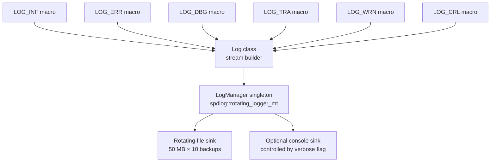

# Logging — `log_manager`

A lightweight logging layer built on top of [spdlog](https://github.com/gabime/spdlog). Provides a singleton logger with rotating file output and stream-style macros.

## Files

| File | Purpose |
|---|---|
| [`log_manager.hpp`](log_manager.hpp) | `LogManager` singleton + `Log` stream class + logging macros (`LOG_INF`, `LOG_ERR`, etc.) |
| [`log_manager.cpp`](log_manager.cpp) | Implementation of logger initialization, rotation, and the `Log` destructor that dispatches to spdlog. |

## Architecture



### `LogManager` — Singleton Logger

A process-wide singleton wrapping a `spdlog::rotating_logger_mt`. Provides:

- **`Initialize(name, path, verbose, maxSizeBytes, maxFiles)`** — Creates the logger with a rotating file sink. Automatically creates parent directories if they don't exist.
  - Default rotation: 50 MB per file × 10 backups (≈500 MB raw).
  - Rotated files are named `<name>.1.log`, `<name>.2.log`, etc.; the active file keeps its original name so external tooling and `logrotate(8)` keep working.
- **`SetLogFilePath(name, path, maxSizeBytes, maxFiles)`** — Drops the existing logger and creates a new one at a different path (useful for reconfiguration without restart).
- **`GetLogger()`** — Returns a reference to the underlying `spdlog::logger`. If no logger has been initialized, returns a default stdout color logger.
- **`IsVerbose()`** — Returns whether console output is enabled alongside file logging.

### `Log` — Stream-style Message Builder

The `Log` class captures contextual metadata (file name, function name, line number) and builds the message incrementally via `operator<<`. The actual spdlog dispatch happens in the destructor:

```cpp
LOG_INF << "Connected to server at " << host << ":" << port;
// At this point (destructor), the full message is dispatched.
```

Each log entry includes:
- Source file name, function name, and line number.
- Thread ID for multi-threaded contexts.

### Logging Macros

| Macro | Level | Console Color |
|---|---|---|
| `LOG_INF` | info | — |
| `LOG_ERR` | error | red (stderr) |
| `LOG_DBG` | debug | — |
| `LOG_TRA` | trace | — |
| `LOG_WRN` | warn | yellow |
| `LOG_CRL` | critical | red (stderr) |

Usage:
```cpp
#include "log/log_manager.hpp"

// Initialize once at startup
LogManager::Initialize("sst", "/var/log/sst.log", true);

// Use anywhere in the codebase
LOG_INF << "Session established with entity " << entity_name;
LOG_ERR << "Failed to connect: " << strerror(errno);
```

## Build-time Behavior

When `GIT_VERSION` is defined at compile time (typically for production builds), **all logging becomes a no-op**. The `Log` constructor and destructor bodies are empty, so the compiler can optimize away the entire statement. This eliminates runtime overhead in release builds while keeping the same source code.

## Pitfalls

1. **Always initialize before use**: Call `LogManager::Initialize()` early (e.g., at program startup). If you don't, `GetLogger()` returns a default stdout logger — logs will still appear but won't be written to your configured file.
2. **`GIT_VERSION` strips logging**: In production builds with this macro defined, log statements compile to nothing. Don't rely on logging for critical error handling or side effects — use proper return values and exceptions instead.
3. **Thread safety**: The `LogManager` logger is thread-safe (`rotating_logger_mt`). However, the `_log_mutex` in the `Log` destructor serializes all log dispatches globally — this is intentional but can be a bottleneck under extreme concurrency.
4. **File path directory creation**: Both `Initialize()` and `SetLogFilePath()` create parent directories automatically, so you don't need to pre-create them. But if the process lacks write permissions on the target directory, initialization will silently fail (no error returned).
