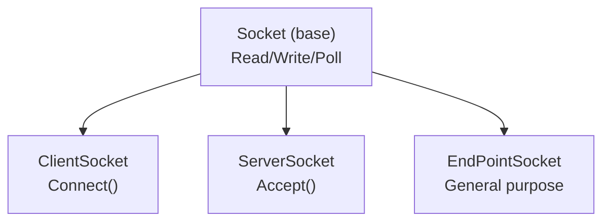

# Network Layer — `sockets`

This directory provides RAII wrappers around POSIX sockets. All types live in the `sst` namespace.

## Files

| File | Purpose |
|---|---|
| [`sockets.hpp`](sockets.hpp) / [`sockets.cpp`](sockets.cpp) | Base socket classes — `Socket`, `ClientSocket`, `ServerSocket`, `EndPointSocket`. Pure TCP, no encryption. |

## Architecture



### `sockets.hpp` — Base TCP sockets

**`SST_SocketInfo`** — RAII container for a raw file descriptor and its address. Closes the FD in the destructor; manages `sockaddr` address storage as a `std::byte` array owned by a `unique_ptr` whose deleter calls `delete[]`. No `malloc` or `free` anywhere in the layer.

**`Socket`** (base class)
- `Write()` guards its operation with a mutex. Reads and all other operations are not uniformly locked; coordinate concurrent access in application code.
- `Read()` loops until the requested byte count, EOF, or error. `Write()` makes one POSIX write call and may write fewer bytes than requested.
- Timeout-aware `NonBlockingRead()` / `NonBlockingWrite()` — temporarily sets `O_NONBLOCK`, falls back to `poll()` if the operation would block, then restores the original flags.
- `Pending()` returns bytes available via `ioctl(FIONREAD)`.
- `ReadyToReadTimeOut(ms)` uses `poll()` with a timeout; `ReadyToRead()` blocks indefinitely.

**`ClientSocket`** — connects to a remote host/port. Constructor takes either an existing `SST_SocketInfo` or `(domain, host, port)`. Call `Connect()` after construction.

**`ServerSocket`** — binds and listens on a local address. Call `Accept(ServerSocket&)` to block until a new connection arrives; the accepted socket is populated into the argument.

**`EndPointSocket`** — creates a `SOCK_STREAM` endpoint. It does not currently provide UDP or raw-socket transport.

## Pitfalls

1. **Non-blocking flag restoration**: `NonBlockingRead()` and `NonBlockingWrite()` temporarily set `O_NONBLOCK`. If an exception occurs between setting and restoring, the socket stays non-blocking — wrap calls in try/catch if you depend on blocking mode afterward.
2. **FD duplication in GetSocketInfo**: Returns a copy with a duplicated FD (`dup()`). Callers should not assume the returned fd is the same as the original — it's an independent OS-level handle.

## Usage Example

```cpp
// Client connection (plain TCP)
sst::ClientSocket client(sst::SST_SOCK_INET, "127.0.0.1", 8080);
client.Connect();
char buf[1024];
int n = client.Read(buf, sizeof(buf));  // waits for 1024 bytes, EOF, or error

// Server-side accept
sst::ServerSocket server(sst::SST_SOCK_INET, "127.0.0.1", 8080);
// Accept currently requires a ServerSocket, so bind its initial listener
// to an ephemeral port. Accept replaces and closes that initial socket.
sst::ServerSocket accepted(sst::SST_SOCK_INET, "127.0.0.1", 0);
server.Accept(accepted);
```

These are separate client and server excerpts. Check `Connect()` / `Accept()` results in application code. For encrypted SST communication, use [`SST_API` and `SST_Session`](https://iotauth.github.io/docs/cpp-guide/) instead of these plain socket wrappers.
