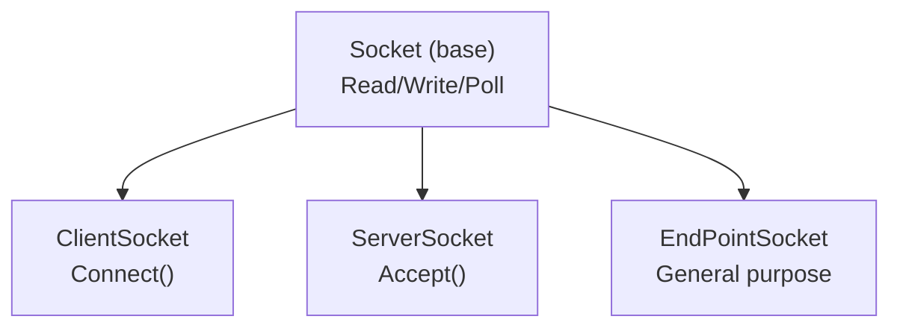

# Network Layer — `sockets`

This directory provides RAII wrappers around POSIX sockets. All types live in the `sst` namespace.

## Files

| File | Purpose |
|---|---|
| [`sockets.hpp`](sockets.hpp) / [`sockets.cpp`](sockets.cpp) | Base socket classes — `Socket`, `ClientSocket`, `ServerSocket`, `EndPointSocket`. Pure TCP, no encryption. |

## Architecture



### `sockets.hpp` — Base TCP sockets

**`SST_SocketInfo`** — RAII container for a raw file descriptor and its address. Closes the FD in the destructor; manages `sockaddr` address storage with `std::make_unique<uint8_t[]>` and a custom deleter that calls `delete[]` on a `uint8_t*`. All allocation is exception-safe — no `malloc` or `free` anywhere in the layer.

**`Socket`** (abstract base)
- Thread-safe I/O: every read/write is guarded by a `mutable std::mutex gate_`.
- Blocking `Read()` / `Write()` — standard POSIX calls.
- Timeout-aware `NonBlockingRead()` / `NonBlockingWrite()` — temporarily sets `O_NONBLOCK`, falls back to `poll()` if the operation would block, then restores the original flags.
- `Pending()` returns bytes available via `ioctl(FIONREAD)`.
- `ReadyToReadTimeOut(ms)` uses `poll()` with a timeout; `ReadyToRead()` blocks indefinitely.

**`ClientSocket`** — connects to a remote host/port. Constructor takes either an existing `SST_SocketInfo` or `(domain, host, port)`. Call `Connect()` after construction.

**`ServerSocket`** — binds and listens on a local address. Call `Accept(ServerSocket&)` to block until a new connection arrives; the accepted socket is populated into the argument.

**`EndPointSocket`** — general-purpose unconnected endpoint (useful for UDP or raw sockets).

## Pitfalls

1. **Non-blocking flag restoration**: `NonBlockingRead()` and `NonBlockingWrite()` temporarily set `O_NONBLOCK`. If an exception occurs between setting and restoring, the socket stays non-blocking — wrap calls in try/catch if you depend on blocking mode afterward.
2. **FD duplication in GetSocketInfo**: Returns a copy with a duplicated FD (`dup()`). Callers should not assume the returned fd is the same as the original — it's an independent OS-level handle.

## Usage Example

```cpp
// Client connection (plain TCP)
sst::ClientSocket client(AF_INET, "127.0.0.1", 8080);
client.Connect();
char buf[1024];
int n = client.Read(buf, sizeof(buf));

// Server-side accept
sst::ServerSocket server(AF_INET, nullptr, 8080);
sst::ClientSocket accepted(nullptr);
server.Accept(accepted);
```
