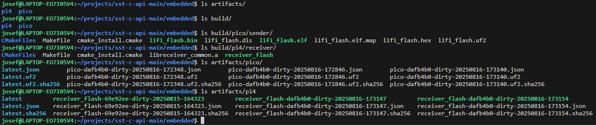

# Secure and Robust Li-Fi Communication for Embedded Systems

This project implements a secure, real-time Li-Fi communication channel between a Raspberry Pi Pico and a host computer. It is designed to be a robust and production-ready embedded system, featuring strong cryptography, persistent key storage, and a rich command interface for easy management.

---

## Project Overview

This repository contains the embedded software for a secure Li-Fi transmitter (the Pico) and the necessary host-side components to manage it. The system is designed to showcase a complete secure communication workflow, from initial key provisioning to real-time encrypted messaging.

-   **Sender (Raspberry Pi Pico)**: A powerful Li-Fi transmitter that encrypts messages using a persistent session key with AES-GCM mode. It operates autonomously and can be managed remotely via a command interface.
-   **Receiver/Controller (Host)**: A host system (like a Raspberry Pi 4 or a PC) is responsible for the initial provisioning of the session key and can be used to receive and decrypt the Li-Fi messages.

<div style="text-align:center;">
  <table style="width:100%; max-width:1100px; margin:0 auto; border-collapse:collapse; border:none;">
    <tr>
      <td style="width:80%; vertical-align:top; padding:0; border:none;">
        <a href="./img/physical_lifi.png">
          
        </a>
      </td>
      <td style="width:20%; vertical-align:top; padding:0; border:none;">
        <h2 style="margin:0 0 .75rem 0;">Hardware Overview</h2>
        <div style="padding-left:10px; box-sizing:border-box; text-align:right;">
          <p><strong>Raspberry Pi Pico</strong><br>
          <em>Purpose:</em> LiFi sender (UART + AES-GCM encryption)<br>
          <em>Connections:</em> LED driver, UART to Pi 4<br>
          <em>Notes:</em> Dual-slot session key caching</p>
          <p><strong>Raspberry Pi 4</strong><br>
          <em>Purpose:</em> LiFi receiver + SST Auth client<br>
          <em>Connections:</em> Photodiode, UART to Pico<br>
          <em>Notes:</em> Fetches and sends session keys</p>
          <p><strong>TC4420 → LED Driver</strong><br>
          <em>Role:</em> Drives high-speed LED modulation<br>
          <em>Supply:</em> 12V DC<br>
          <em>Notes:</em> Fast rise/fall times for LiFi</p>
          <p><strong>OP350 ← Photodiode</strong><br>
          <em>Role:</em> Detects modulated light from LED<br>
          <em>Biasing/Drive:</em> Reverse-biased for speed<br>
          <em>Notes:</em> Feeds comparator input</p>
          <p><strong>TLV3501 Comparator</strong><br>
          <em>Role:</em> Converts analog photodiode signal to digital<br>
          <em>Threshold/Ref:</em> Tuned for reliable detection<br>
          <em>Notes:</em> Low propagation delay</p>
          <p><strong>12V DC ⚡ to Breadboard</strong><br>
          <em>Purpose:</em> Power LED driver circuit<br>
          <em>Notes:</em> Feeds TC4420 module</p>
        </div>
      </td>
    </tr>
  </table>
</div>

## Key Features:

- **Authenticated Encryption:**  
&nbsp;&nbsp;&nbsp;&nbsp;Utilizes **AES-256-GCM** for state-of-the-art encryption and message authentication, protecting against both eavesdropping and tampering.

- **Robust Key Persistence:**  
&nbsp;&nbsp;&nbsp;&nbsp;Implements a redundant **A/B slot system** in the Pico's flash memory to ensure the session key survives reboots and power loss. The system automatically falls back to a valid key if one slot is corrupted.

- **Secure Key Provisioning:**  
&nbsp;&nbsp;&nbsp;&nbsp;On first boot/empty slot, listens on **UART1** with preamble 0xAB 0xCD to receive the session key (e.g., from the Pi 4/auth client). Supports `new key` and `new key -f` for controlled overwrite.

- **Watchdog Timer:**  
&nbsp;&nbsp;&nbsp;&nbsp;The Pico (sender) is monitored by a hardware watchdog that automatically reboots the device if it becomes unresponsive, ensuring high availability.

- **Secure Memory Handling:**  
&nbsp;&nbsp;&nbsp;&nbsp;Sensitive data like keys, nonces, and ciphertext are securely zeroed from memory after use with `secure_zero()` to limit in-RAM exposure.

- **Interactive Command Interface:**  
&nbsp;&nbsp;&nbsp;&nbsp;A rich set of commands allows for real-time management of the device, including key management, slot status checks, and diagnostics.

- **Modular & Reusable Code:**  
&nbsp;&nbsp;&nbsp;&nbsp;The project is built with a modular architecture, separating hardware-specific logic (`pico_handler`), command processing (`cmd_handler`), and the main application logic for maximum reusability and maintainability.

- **Cryptographically Secure PRNG:**  
&nbsp;&nbsp;&nbsp;&nbsp;mbedTLS CTR_DRBG seeded from the RP2040 ring-oscillator via `pico_hardware_entropy_poll()` → high-quality randomness for salts and other needs.


---

## Project Architecture

The code is organized into a modular structure:

-   `src/`: Core logic, including the command handler (`cmd_handler.c`) and Pico-specific/Pi-4 specific functions (`pico_handler.c`)/(`pi_handler.c`).
- - `note`: `pi_handler.c` is under construction
-   `include/`: Header files defining the public interface for each module.
-   `sender/src/`: The main application firmware (`lifi_flash.c`) for the Pico transmitter.
-   `lib/`: External libraries, including `mbedtls`, `pico-sdk`, and `picotool`.
-   `CMakeLists.txt`: The main build file that orchestrates the compilation of all modules and targets.

---

## Project Structure

```plaintext
sst-c-api/embedded
├── CMakeLists.txt              # Root CMake build configuration
├── CMakePresets.json           # Preset build settings for CMake
├── README.md                   # Project documentation
├── notes.txt                   # Developer notes and references
│
├── 📁 build/                   # (Generated) Build artifacts from CMake
│
├── 📁 config/
│   └── mbedtls_config.h        # mbedTLS configuration settings
│
├── 📁 include/
│   ├── cmd_handler.h           # Command processing interface
│   ├── config_handler.h        # Configuration management interface
│   ├── pico_handler.h          # Pico-specific helper functions
│   └── sst_crypto_embedded.h   # Embedded crypto API definitions
│
├── 📁 lib/
│   └── mbedtls/                # mbedTLS cryptographic library source
│   ├── 📁 pico-sdk/            # Raspberry Pi Pico C/C++ SDK
│   └── 📁 picotool/            # CLI utility for Pico boards
│
├── 📁 receiver/
│   ├── CMakeLists.txt          # Receiver build configuration
│   ├── 📁 config/              # Receiver-specific config files
│   ├── 📁 src/                 # Receiver source code
│   ├── sst.config              # Receiver runtime configuration
│   └── update-credentials.sh   # Script to update stored credentials
│
├── 📁 sender/
│   ├── CMakeLists.txt          # Sender build configuration
│   └── 📁 src/                 # Sender source code
│
└── 📁 src/
    ├── cmd_handler.c           # Command processing implementation
    ├── config_handler.c        # Configuration management logic
    ├── pico_handler.c          # Pico helper logic
    └── sst_crypto_embedded.c   # Embedded crypto API implementation
```

## Hardware Requirements

### **Sender (Pico)**
- [Raspberry Pi Pico (RP2040)](https://www.sparkfun.com/raspberry-pi-pico.html?src=raspberrypi)
- Li-Fi LED transmitter module
- USB cable (for programming and debug serial)

### **Receiver (Pi 4)**
- [Raspberry Pi 4 Model B (4 GB)](https://www.sparkfun.com/raspberry-pi-4-model-b-4-gb.html?src=raspberrypi)
- Li-Fi receiver module

---

## 📖 Pinout References

For full details on the board headers:

* **Raspberry Pi Pico (RP2040)** → [Pico Pinout (official PDF)](https://datasheets.raspberrypi.com/pico/Pico-R3-A4-Pinout.pdf)
* **Raspberry Pi 4 (40-pin header)** → [Pi 4 GPIO Pinout (pinout.xyz)](https://pinout.xyz/pinout/pin8_gpio14#)

---

## 🔌 UART1 Wiring (Pico ↔ Pi 4)

| Function     | Pico Pin (RP2040) | Pi 4 Header Pin | Pi 4 GPIO | Notes                      |
| ------------ | ----------------- | --------------- | --------- | -------------------------- |
| **UART1 TX** | GPIO4 (Pin 6)     | Pin 10          | GPIO15 RX | Pico sends → Pi 4 receives |
| **UART1 RX** | GPIO5 (Pin 7)     | Pin 8           | GPIO14 TX | Pico receives ← Pi 4 sends |
| **Ground**   | GND (Pin 38)      | Pin 6           | GND       | Common ground required     |

> ⚠️ TX ↔ RX must cross: Pico TX → Pi RX, Pico RX ← Pi TX.

---

## ⚙️ Pico Firmware Setup

```c
#define UART_ID uart1
#define UART_TX_PIN 4
#define UART_RX_PIN 5
#define BAUD_RATE 1000000

uart_init(UART_ID, BAUD_RATE);
gpio_set_function(UART_TX_PIN, GPIO_FUNC_UART);
gpio_set_function(UART_RX_PIN, GPIO_FUNC_UART);
```

---

## ⚙️ Raspberry Pi 4 Setup

1. Enable UART in `/boot/config.txt`:

   ```ini
   enable_uart=1
   ```
2. Reboot, then check:

   ```bash
   ls -l /dev/serial0
   ```

   It should link to `/dev/ttyAMA0` or `/dev/ttyS0`.
3. Open the port at 1 Mbps:

   ```bash
   stty -F /dev/serial0 1000000
   screen /dev/serial0 1000000
   ```

---

## Software Dependencies

-   CMake ≥ 3.13
-   ARM GCC Toolchain
-   [Pico SDK](https://github.com/raspberrypi/pico-sdk)
-   (Optional for Host) [iotauth](https://github.com/iotauth/iotauth) project for advanced key provisioning.

---

# Embedded build quickstart

This repo builds two targets:

* **`pico`** → RP2040 sender firmware (`.uf2`)
* **`pi4`** → Linux receiver executable (tested on Ubuntu/WSL)

The build scripts take care of submodules, the Pico SDK, and `picotool` for you. You only need the system packages below.

## 0) Prerequisites (once per machine)

**Ubuntu / WSL**

```bash
sudo apt update
sudo apt install -y build-essential cmake git pkg-config \
  ninja-build \
  # Pico toolchain (for `pico` builds)
  gcc-arm-none-eabi libnewlib-arm-none-eabi \
  # Needed to build picotool once
  libusb-1.0-0-dev
# (pi4 builds will use your system gcc; if OpenSSL is missing:)
sudo apt install -y libssl-dev
```
### Also install for scripts:
```
sudo apt install -y libusb-1.0-0-dev pkg-config
```

**Optional speed-ups:**
Install `ninja-build` to make builds faster on repeats

## 1) Clone (with submodules)

```bash
git clone --recurse-submodules https://github.com/iotauth/sst-c-api.git
cd sst-c-api/embedded
# (If you forgot --recurse-submodules)
git submodule update --init --recursive
```

> We pin the Pico SDK, Mbed TLS, and picotool as submodules under `embedded/lib/`.
## set a /pico-sdk path (fix laterc)
```
echo 'export PICO_SDK_PATH="$HOME/sst-c-api/embedded/lib/pico-sdk"' >> ~/.bashrc
```
```
source ~/.bashrc

```
## 2) Pick a target (one-liner)
> from inside sst-c-api/embedded/

```bash
./set_build.sh pico    # or: ./set_build pi4
```

This writes `.build_target` and tells the scripts which tree to build.

## 3) Build

```bash
./run_build.sh pico    # builds to build/pico/, copies artifacts to artifacts/pico/
# or
./run_build.sh pi4     # builds to build/pi4/,   copies artifacts to artifacts/pi4/
````

* On the **first Pico build**, we will build and “install” a local **picotool** under `embedded/.tooling/picotool/` and wire CMake to use it automatically.
* Subsequent runs **reuse** it (no warning spam, no re-build).

### Where to find results

* **Pico:** `artifacts/pico/latest.uf2` (+ `latest.uf2.sha256`, `latest.json`)
* **Pi4:**  `artifacts/pi4/latest` (executable) (+ `latest.sha256`, `latest.json`)

We also keep a short **history** of prior builds next to `latest*`, and prune to the last **3** build sets by default. Override per run:

```bash
KEEP_BUILDS=5 ./run_build.sh pi4
```

#### Build Artifacts Layout

<p align="center">
  
</p>

### Verify checksum (optional)

```bash
( cd artifacts/pi4 && sha256sum -c latest.sha256 )
( cd artifacts/pico && sha256sum -c latest.uf2.sha256 )
```

---

## 4) Running the receiver (Pi4/Linux)

From `embedded/`:

```bash
./artifacts/pi4/latest sst.config
```

> The receiver expects a valid `sst.config` (paths, endpoints, keys). If you get something like “Failed to find default config”, run it from `embedded/` or pass an explicit config path.

---

## Notes

* **You normally do *not* need** `PICO_SDK_PATH` or `PICO_TOOLCHAIN_PATH`.
  Our CMake pins the SDK to `embedded/lib/pico-sdk`. If you installed ARM GCC via apt, we’ll find `arm-none-eabi-gcc` on PATH automatically.

* **Custom toolchain location (optional):**

  ```bash
  export PICO_TOOLCHAIN_PATH="$HOME/toolchains/arm-gnu-13.2.rel1"  # contains bin/arm-none-eabi-gcc
  ```

  Only set this if `arm-none-eabi-gcc` is not on your PATH.

* **Build type:** default is `Release`. Override per run:

  ```bash
  BUILD_TYPE=Debug ./run_build.sh pico
  ```

* **Verbose build (debug the script):**

  ```bash
  RUN_VERBOSE=1 ./run_build.sh pico
  ```

---

## Common issues (and quick fixes)

* **`Could NOT find OpenSSL (missing: OPENSSL_CRYPTO_LIBRARY)`** (pi4):
  `sudo apt install -y libssl-dev`

* **`No installed picotool with version …`** (pico):
  Our script builds a local picotool once; ensure `libusb-1.0-0-dev` is installed, then re-run `./run_build pico`.

* **`pico_sdk_init.cmake not found`** or missing SDK:
  `git submodule update --init --recursive` (we vendored the SDK under `embedded/lib/pico-sdk`).

* **Assembler errors like `.syntax`/`.cpu`** during Pico builds:
  You’re using the **host gcc** instead of ARM GCC. Install `gcc-arm-none-eabi libnewlib-arm-none-eabi`, or set `PICO_TOOLCHAIN_PATH` to your ARM toolchain root.

* **WSL feels slow:** Make sure the repo lives under `/home/<you>/…`, not `/mnt/c/…`.

---

## Directory layout (after first build)
```
embedded/
├─ build/
│  ├─ pico/         # out-of-tree build for Pico target
│  ├─ pi4/          # out-of-tree build for Pi4 target
│  └─ _picotool/    # temp CMake build dir for picotool (first run only)
├─ .tooling/
│  └─ picotool/     # locally installed picotool (bin + CMake package)
├─ artifacts/
│  ├─ pico/         # latest.uf2 + history + checksums + manifests
│  └─ pi4/          # latest (exe) + history + checksums + manifests
└─ lib/
   ├─ pico-sdk/     # submodule: Raspberry Pi Pico SDK
   ├─ mbedtls/      # submodule: vendored mbedTLS we build against
   └─ picotool/     # submodule: picotool source (built once into .tooling/)
```

**Notes**

* `build/*` is throwaway; safe to delete any time.
* `.tooling/picotool` is the reusable local install that suppresses SDK warnings.
* `artifacts/<target>/latest*` always points to the newest build; older builds are pruned.
---


### 4) Flash the Pico 

After `./run_build.sh pico`, your firmware is here: `artifacts/pico/latest.uf2`.

**Option A — Drag & drop (BOOTSEL mode)**

1. Unplug the Pico. Hold **BOOTSEL** while plugging it in (it mounts as a USB drive).
2. Copy the UF2:

```bash
UF2="artifacts/pico/latest.uf2"
DEST="$(ls -d /media/$USER/RPI-RP2 /run/media/$USER/$USER/RPI-RP2 2>/dev/null | head -n1)"
cp "$UF2" "$DEST"/
```

> Adjust `DEST` if your system mounts the drive somewhere else (e.g., `/media/user/RPI-RP2`). On Windows, just drag `latest.uf2` onto the `RPI-RP2` drive in Explorer.

**Option B — Flash with picotool (no file manager needed)**
We vendor & auto-install picotool at `embedded/.tooling/picotool/bin/picotool`.

```bash
# If the Pico is running your app, reboot it into BOOTSEL:
.embedded/.tooling/picotool/bin/picotool reboot -f

# Then load the UF2 (with Pico in BOOTSEL):
.embedded/.tooling/picotool/bin/picotool load -f artifacts/pico/latest.uf2
```

> Tip: `picotool info -a` shows connected boards; `picotool help` lists commands.

---

This replaces the old `cp sender/lifi_flash.uf2 ...` line and always uses the canonical `artifacts/pico/latest.uf2`.


---


## How to Run

This guide outlines the steps to provision the Pico with a session key from the host and establish secure communication.

### 1. Prerequisites

-   All hardware is connected, especially the **Pico ↔ Pi 4 UART** connection (see [wiring details](#-uart1-wiring-pico--pi-4)).
-   The firmware and executables have been built successfully using `./run_build.sh`.
-   The `sst.config` file is present in the `embedded/` directory and all paths are correct.

### 2. Configure and Start the Receiver (Pi 4 / Host)

Before the receiver can fetch a session key, you must provide it with the necessary credentials to authenticate with the SST Auth.

1.  **Update Credentials**:  
    Run the interactive script to configure the client certificate, private key, and CA certificate paths that the receiver will use.

    ```bash
    ./receiver/update-credentials.sh
    ```
    Follow the prompts to provide the paths to your PEM-encoded credential files. This will update the `sst.config` file.

2.  **Start the Receiver**:  
    With the credentials configured, run the receiver program. It will connect to the SST Auth to get a 16-byte session key and then send it to the Pico.

    ```bash
    ./artifacts/pi4/latest sst.config
    ```

3.  **Monitor Output**:  
    The receiver will print "Retrieving session key from SST..." and, upon success, "Sent preamble + session key over UART." It is now actively listening for encrypted messages from the Pico.

### 3. Provision the Sender (Pico)

Next, power on the Pico. If it's the first time running or its key slots are empty, it will automatically enter provisioning mode.

1.  **Flash the firmware** (`artifacts/pico/latest.uf2`) to the Pico. If it's already flashed, simply reset it or unplug and plug it back in.
2.  Connect to the Pico's **USB serial port** with a terminal emulator (e.g., `screen`, `minicom`, PuTTY) to monitor its status.
3.  On boot, the Pico will fail to find a key and print:
    ```
    No valid session key found. Waiting for one...
    ```
4.  The **Receiver**, which was already waiting, will send the key. The Pico will receive it, save it to flash, and confirm with:
    ```
    Received session key: <hex>
    Key saved to flash slot A.
    ```

The Pico is now provisioned and ready to communicate securely.

### 4. Send Encrypted Messages

Once provisioned, the system is ready for use.

1.  In the Pico's USB serial terminal, type any message (e.g., `hello world`) and press Enter.
2.  The Pico will encrypt the message and send it over the Li-Fi UART.
3.  The Receiver's terminal will display the decrypted message:
    ```
    Decrypted: hello world
    ```

### 5. Key Rotation and Management

You can manage the session key from the Pico's serial console.

-   **Request a New Key from SST**: To have the receiver fetch and send a new session key, simply type `new key` or `new key -f` (force) as a message in the Pico's terminal. The receiver will handle the request and provision the Pico with the new key.

---

### 3) Live commands (remote management)

Use the on-device command interface over the Pico’s USB serial:

* Check key status:

  ```
  CMD: slot status
  ```
* (Other commands live here; see the “Command reference” section if you add more.)

---

### Troubleshooting quickies

* **Nothing prints on USB:** Ensure your terminal is on the Pico’s USB CDC port and baud is 115200. Unplug/replug while holding **BOOTSEL** to reflash if needed.
* **Key not accepted:** Make sure you sent exactly **2 bytes of preamble** (`AB CD`) + **32 bytes of key** (not ASCII text unless your firmware converts it).
* **Receiver can’t decrypt:** Double-check both sides use the **same 32-byte key** and the receiver was restarted/reloaded after provisioning.

---

## Command Interface

Interact with the Pico over the USB serial connection. All commands are prefixed with `CMD:`.

| Command                    | Description |
| -------------------------- | -------------------------------------------------------------------- |
| `help`                     | Displays a list of all available commands.                           |
| `print key`                | Prints the currently active session key.                             |
| `slot status`              | Shows the validity of key slots A and B and which one is active.     |
| `use slot A` / `use slot B`  | Switches the active session key to the one in the specified slot.    |
| `clear slot A` / `clear slot B`| Erases the key from the specified slot.                              |
| `new key`                  | Waits to receive a new key, but only if the current slot is empty.   |
| `new key -f`               | Forcibly overwrites the key in the current slot.                     |
| `print slot key A` / `B` / `*` | Prints the key stored in a specific slot (or all slots).             |
| `entropy test`             | Prints a sample of random data from the hardware RNG for verification. |
| `reboot`                   | Reboots the Pico.                                                    |

---


## Notes & Future Work

-   The system is designed for high reliability, automatically recovering from reboots and provisioning itself on first run.
-   Future work could include:
    -   A GUI-based host application for managing multiple devices.
    -   Support for secure file transfers over Li-Fi.
    -   Integration with a hardware Trusted Platform Module (TPM) on the host for even more secure key storage.
