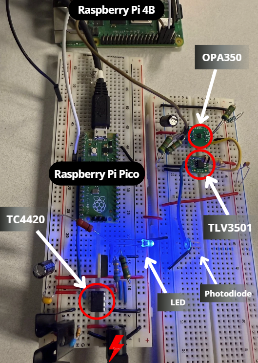

# Secure and Robust Li-Fi Communication for Embedded Systems

This project implements a secure, real-time Li-Fi communication channel between a Raspberry Pi Pico and a host computer. It is designed to be a robust and production-ready embedded system, featuring strong cryptography, persistent key storage, and a rich command interface for easy management.

---

## Project Overview

This repository contains the embedded software for a secure Li-Fi transmitter (the Pico) and the necessary host-side components to manage it. The system is designed to showcase a complete secure communication workflow, from initial key provisioning to real-time encrypted messaging.

-   **Sender (Raspberry Pi Pico)**: A powerful Li-Fi transmitter that encrypts messages using AES-GCM and a persistent session key. It operates autonomously and can be managed remotely via a command interface.
-   **Receiver/Controller (Host)**: A host system (like a Raspberry Pi 4 or a PC) is responsible for the initial provisioning of the session key and can be used to receive and decrypt the Li-Fi messages.

<!-- Hardware Overview -->
<table width="100%" style="border-collapse: collapse;">
  <tr>
    <td style="vertical-align: top; padding-right: 20px; border: none;">
      <a href="./img/physical_lifi.png">
        
      </a>
    </td>
    <td style="vertical-align: top; border: none;">

### Hardware Overview

- **Raspberry Pi Pico**  
  _Purpose:_ …  
  _Connections:_ …  
  _Notes:_ …  

- **Raspberry Pi 4**  
  _Purpose:_ …  
  _Connections:_ …  
  _Notes:_ …  

- **TC4420 — MOSFET/LED Driver**  
  _Role:_ …  
  _Supply:_ …  
  _Notes:_ …  

- **OP350 — Emitter/Photodiode**  
  _Role:_ …  
  _Biasing/Drive:_ …  
  _Notes:_ …  

- **TLV3501 — High-Speed Comparator**  
  _Role:_ …  
  _Threshold/Ref:_ …  
  _Notes:_ …  

    </td>
  </tr>
</table>


### Key Features:

-   **Authenticated Encryption**: Utilizes **AES-256-GCM** for state-of-the-art encryption and message authentication, protecting against both eavesdropping and tampering.
-   **Robust Key Persistence**: Implements a redundant **A/B slot system** in the Pico's flash memory to ensure the session key survives reboots and power loss. The system automatically falls back to a valid key if one slot is corrupted.
-   **Secure Key Provisioning**: On first boot/empty slot, listens on **UART1** with preamble 0xAB 0xCD to receive the session key (e.g., from the Pi 4/auth client). Supports `new key` and `new key -f` for controlled overwrite.
-   **Watchdog Timer**: The system is monitored by a hardware watchdog that automatically reboots the device if it becomes unresponsive, ensuring high availability.
-   **Secure Memory Handling**: Sensitive data like keys, nonces, and ciphertext are securely zeroed from memory after use with `secure_zero()` right after use to limit in-RAM exposure.
-   **Interactive Command Interface**: A rich set of commands allows for real-time management of the device, including key management, slot status checks, and diagnostics.
-   **Modular & Reusable Code**: The project is built with a modular architecture, separating hardware-specific logic (`pico_handler`), command processing (`cmd_handler`), and the main application logic for maximum reusability and maintainability.
-   **Cryptographically Secure PRNG:**: mbedTLS CTR_DRBG seeded from the RP2040 ring-oscillator via pico_hardware_entropy_poll() → high-quality randomness for salts and other needs.

---

## Project Architecture

The code is organized into a modular structure:

-   `src/`: Core logic, including the command handler (`cmd_handler.c`) and Pico-specific functions (`pico_handler.c`).
-   `include/`: Header files defining the public interface for each module.
-   `sender/`: The main application firmware (`lifi_flash.c`) for the Pico transmitter.
-   `lib/`: External libraries, such as `mbedtls`.
-   `CMakeLists.txt`: The main build file that orchestrates the compilation of all modules and targets.

---

## Project Structure

```plaintext
sst-c-api/embedded
├── CMakeLists.txt              # Root CMake build configuration
├── CMakePresets.json           # Preset build settings for CMake
├── README.md                   # Project documentation
├── notes.txt                   # Developer notes and references
│
├── 📁 build/                   # (Generated) Build artifacts from CMake
│
├── 📁 config/
│   └── mbedtls_config.h        # mbedTLS configuration settings
│
├── 📁 include/
│   ├── cmd_handler.h           # Command processing interface
│   ├── config_handler.h        # Configuration management interface
│   ├── mbedtls_time_alt.h      # Custom time source for mbedTLS
│   ├── pico_handler.h          # Pico-specific helper functions
│   ├── ram_handler.h           # Session key / RAM management
│   └── sst_crypto_embedded.h   # Embedded crypto API definitions
│
├── 📁 lib/
│   └── mbedtls/                # mbedTLS cryptographic library source
│
├── 📁 receiver/
│   ├── CMakeLists.txt          # Receiver build configuration
│   ├── 📁 config/              # Receiver-specific config files
│   ├── 📁 src/                 # Receiver source code
│   ├── sst.config              # Receiver runtime configuration
│   └── update-credentials.sh   # Script to update stored credentials
│
├── 📁 sender/
│   ├── CMakeLists.txt          # Sender build configuration
│   └── 📁 src/                 # Sender source code
│
└── 📁 src/
    ├── cmd_handler.c           # Command processing implementation
    ├── config_handler.c        # Configuration management logic
    ├── mbedtls_time_alt.c      # Custom mbedTLS time source
    ├── pico_handler.c          # Pico helper logic
    ├── pico_helper.c           # Additional Pico utility functions
    └── sst_crypto_embedded.c   # Embedded crypto API implementation
```

## Hardware Requirements

### **Sender (Pico)**
- [Raspberry Pi Pico (RP2040)](https://www.sparkfun.com/raspberry-pi-pico.html?src=raspberrypi)
- Li-Fi LED transmitter module
- USB cable (for programming and debug serial)

### **Receiver (Pi 4)**
- [Raspberry Pi 4 Model B (4 GB)](https://www.sparkfun.com/raspberry-pi-4-model-b-4-gb.html?src=raspberrypi)
- Li-Fi receiver module

### **Connection (UART1)**
- **Pico TX (GPIO 4)** → **Pi 4 RX (GPIO14, Pin 8)**
- **Pico RX (GPIO 5)** ← **Pi 4 TX (GPIO15, Pin 10)**

---

## Software Dependencies

-   CMake ≥ 3.13
-   ARM GCC Toolchain
-   [Pico SDK](https://github.com/raspberrypi/pico-sdk)
-   (Optional for Host) [iotauth](https://github.com/iotauth/iotauth) project for advanced key provisioning.


ADD ARM sudo apt update
```bash
sudo apt install -y gcc-arm-none-eabi libnewlib-arm-none-eabi cmake git build-essential ninja-build
```

confirm with arm-none-eabi-gcc --version
- if that prints go ahead and tell the pico SDK where to look now:
```bash
echo 'export PICO_TOOLCHAIN_PATH=/usr' >> ~/.bashrc
source ~/.bashrc
```


---

## Setup & Build

### 1. Clone the Repository
```bash
git clone --recurse-submodules <repo-url>
cd embedded
```

### 2. Configure Pico SDK
```bash
export PICO_SDK_PATH=/path/to/pico-sdk
```

### 3. Build the Firmware
```bash
mkdir build && cd build
cmake ..
make
```

### 4. Flash the Pico
Connect the Pico to your computer while holding the `BOOTSEL` button. Then, copy the firmware to the Pico's USB mass storage device.
```bash
cp sender/lifi_flash.uf2 /media/user/RPI-RP2
```

---

## How to Run
**1. First-Time Key Provisioning:**
   - Flash a cleared device. On the Pico's USB serial monitor, you will see the message: `No valid session key found. Waiting for one...`
   - From a host computer connected to the Li-Fi UART, send a 32-byte secret key.
   - The Pico will respond with `Received session key: <key>` and save it to a flash slot. The secure channel is now established.

**2. Secure Communication:**
   - Reboot the Pico. It will now automatically load the key from flash and print `Using session key: <key>`.
   - Type any message into the serial monitor (e.g., `This is a secret message!`).
   - The Pico will encrypt it and transmit it over the Li-Fi LED. A receiver with the same key can now decrypt and authenticate the message.

**3. Remote Management:**
   - Use the command interface (see below) to interact with the device in real-time. For example, type `CMD: slot status` to verify the key is valid in its slot.

---

## Command Interface

Interact with the Pico over the USB serial connection. All commands are prefixed with `CMD:`.

| Command                    | Description |
| -------------------------- | -------------------------------------------------------------------- |
| `help`                     | Displays a list of all available commands.                           |
| `print key`                | Prints the currently active session key.                             |
| `slot status`              | Shows the validity of key slots A and B and which one is active.     |
| `use slot A` / `use slot B`  | Switches the active session key to the one in the specified slot.    |
| `clear slot A` / `clear slot B`| Erases the key from the specified slot.                              |
| `new key`                  | Waits to receive a new key, but only if the current slot is empty.   |
| `new key -f`               | Forcibly overwrites the key in the current slot.                     |
| `print slot key A` / `B` / `*` | Prints the key stored in a specific slot (or all slots).             |
| `entropy test`             | Prints a sample of random data from the hardware RNG for verification. |
| `reboot`                   | Reboots the Pico.                                                    |

---


## Notes & Future Work

-   The system is designed for high reliability, automatically recovering from reboots and provisioning itself on first run.
-   Future work could include:
    -   A GUI-based host application for managing multiple devices.
    -   Support for secure file transfers over Li-Fi.
    -   Integration with a hardware Trusted Platform Module (TPM) on the host for even more secure key storage.
