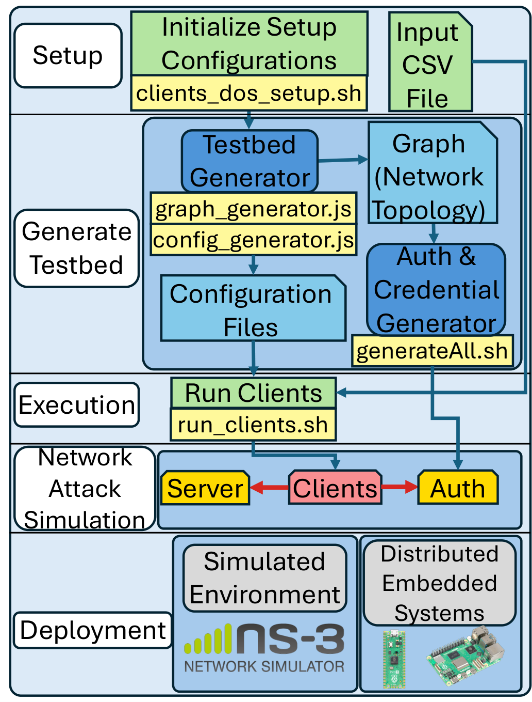
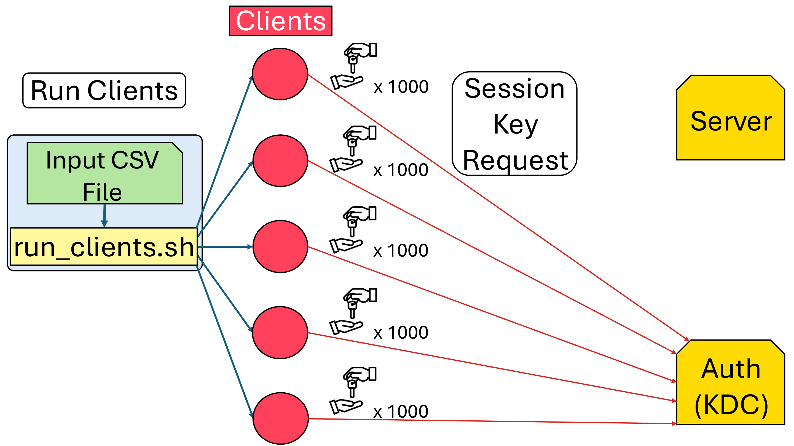
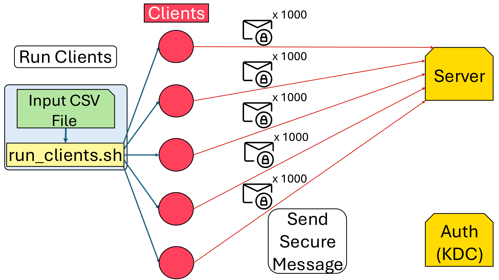
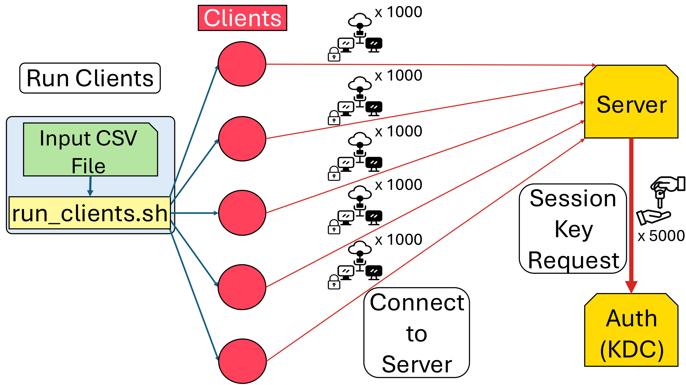
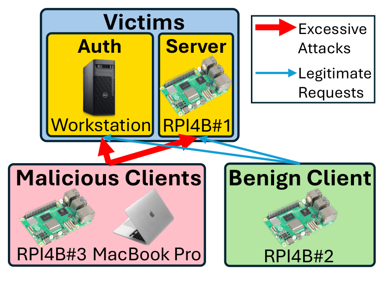
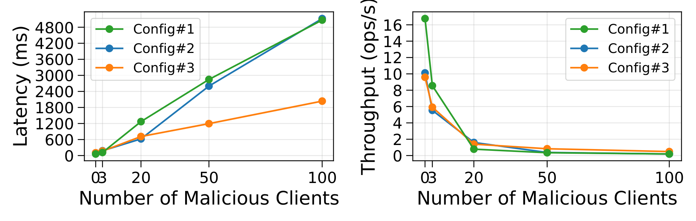
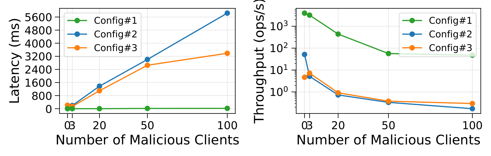
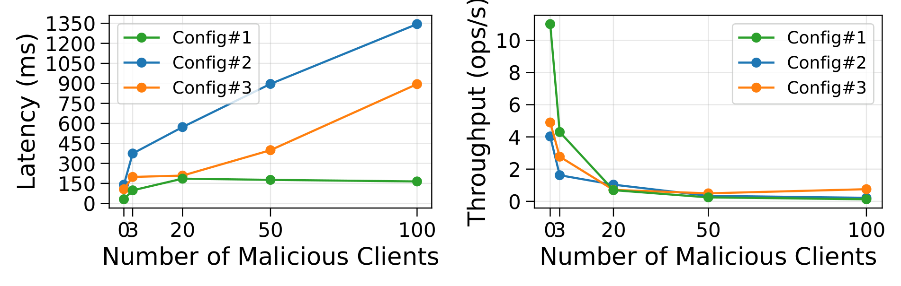
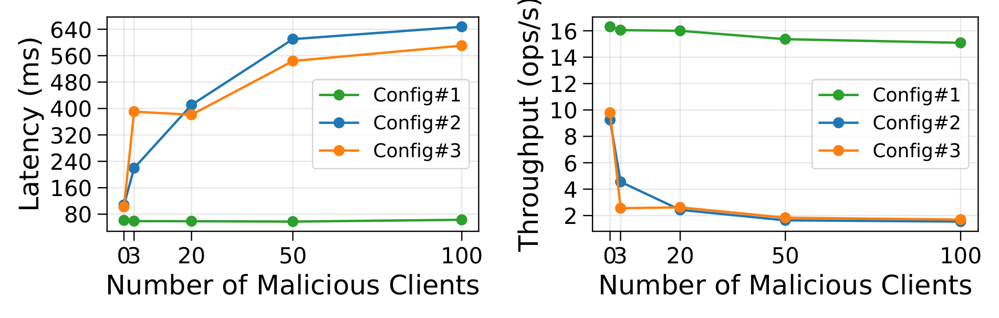

# SST Testbed
---

SST Testbed is an open-source, extensible platform for evaluating the security and resilience of embedded, resource-constrained networked systems. It supports replay and denial-of-service (DoS) attacks — including distributed variants — through configurable CSV input files and lightweight scripts that simplify setup and experimentation.

> **Publication:** C. Beltran Quinonez, D. Kim, and H. Kim, "SST Testbed: An Experimental Platform of Attacks and Defenses for Networked Embedded Systems," in *Proc. 2026 IEEE International Conference on Industrial Technology (ICIT)*, 2026.
> DOI: [10.1109/ICIT64854.2026.11490150](https://ieeexplore.ieee.org/document/11490150)

---

# Background

## Overview

The growing prevalence of IoT devices has introduced significant security challenges, as their constant connectivity and limited resources make them vulnerable to network-level attacks. SST Testbed addresses the lack of open-source security testbeds designed for constrained environments by providing a practical, reproducible environment for attack simulation and defense evaluation.

SST Testbed builds upon the [Secure Swarm Toolkit (SST)](https://github.com/iotauth/iotauth) using the C API. SST introduces a local authorization entity, **Auth**, that acts as a Key Distribution Center (KDC), providing authentication and authorization services for connected devices.

## Workflow

The testbed workflow is organized into five stages:



1. **Setup** — The user specifies the number of clients and attack type via an input CSV file, then runs `clients_dos_setup.sh` to initialize the environment.
2. **Generate Testbed** — `graph_generator.js` produces the network topology; `config_generator.js` creates per-entity configuration files (credential paths, Auth IP/port, Auth ID, entity name).
3. **Execution** — `run_clients.sh` launches the specified number of clients and the server, each loading its configuration file.
4. **Network Attack Simulation** — Clients carry out attack scenarios defined in the CSV (replay, excessive key requests, message flooding, repeated connections).
5. **Deployment** — The generated artifacts can run in simulation (ns-3) or be deployed directly to embedded devices such as Raspberry Pi boards without modifying attack logic.

## Supported Attacks

### Replay Attack

The user manipulates the sequence number attached to each client message. Changing the sequence number simulates replaying a previous message to confuse or manipulate the server. The CSV parameter specifies the sequence number modification (`seq++`, `seq--`, `seq=N`).

### DoS / DDoS via Session Key Requests (DoSK)

Clients issue an excessive number of session key requests to the Auth/KDC, exhausting its key-provisioning capacity and preventing legitimate clients from obtaining keys.



### DoS / DDoS via Message Flooding (DoSM)

Once a session is established, clients flood the server with a large volume of secure messages, overwhelming its message-handling loop and network buffers.



### DoS / DDoS via Connection Requests (DoSC)

Clients repeatedly connect to the server, consuming its CPU and memory for session management. Each connection also triggers a session key request to Auth, amplifying load on both the server and Auth.



### DoS / DDoS via SYN Flooding

Unlike the attacks above, a SYN flood requires no authentication. The attacker sends a large number of TCP SYN packets without completing the handshake, filling the target's connection table with half-open entries. A botnet can amplify this into a DDoS by distributing SYN streams across many sources.

## Experimental Setup and Results

The testbed was evaluated across three hardware configurations:

| Config | Auth | Server | Benign Client | Attacker |
|--------|------|--------|---------------|----------|
| #1 | Workstation | Workstation | Workstation 2 | MacBook Pro |
| #2 | Workstation | RPI 4B #1 | RPI 4B #2 | RPI 4B #3 |
| #3 | Workstation | RPI 4B #1 | RPI 4B #2 | RPI 4B #3 + MacBook Pro |



### DDoS Key Attack Results
Benign client latency grows linearly up to **85x** and throughput drops up to **98.9%** as malicious clients increase from 0 to 100.



### DDoS Message Attack Results
Latency increases up to **301x** and throughput decreases up to **99.99%**.



### DDoS Connect Attack Results
Latency increases up to **9.6x** and throughput decreases up to **98.8%**. With 100 attackers, 90 out of 100 benign connection attempts failed.



### DDoS SYN Flood Results
Latency increased up to **6.0x** and throughput decreased up to **82.7%**. No key-request failures were observed.



---

# Prerequisites
### ***Auth***
1. OpenSSL command line tools for creating certificates and keystores of Auths and example entities
2. Java 11 or above
3. [Maven CLI (command line interface)](http://maven.apache.org/ref/3.1.0/maven-embedder/cli.html) for building Auth from the command line
4. Node.js for running example server and client entities
### `sst-c-api`
1. OpenSSL 3.0 or above
2. CMake 3.19 or above
## Installation
### Debian/Ubuntu
```
sudo apt-get update && sudo apt-get install -y \
    openjdk-11-jdk \
    maven \
    nodejs \
    npm \
    openssl \
    cmake \
    build-essential \
    pkg-config \
    libssl-dev
```
---
### MacOS
```
brew install openjdk@11 maven node openssl cmake pkg-config
```

## Verify versions
```
java -version
mvn -version
node -v
openssl version
cmake --version
```

## Clone repository & Update submodule
```
$ git clone https://github.com/iotauth/iotauth.git
$ cd iotauth
$ git submodule update --init
```

# Compilation

### Compilation of Auth

1. Go to directory `iotauth/examples`

### Compile the SST_Testbed code

1. Go to `iotauth/entity/c/examples/SST_Testbed/`

2. Run `mkdir build && cd build`

3. Run `cmake ..`.
    - Run `cmake -DCMAKE_BUILD_TYPE=Debug ..` for debugging mode.

4. Run `make`

# Running Examples
We have multiple examples to run.
1. Basic messaging examples with no attacks.
2. Attack scenarios
    - **2.1** Replay attack
    - **2.2** Denial of Service (DoS) attacks
        - **2.2.1** to Auth via session key requests (DoSK)
        - **2.2.2** to server via sending messages (DoSM)
        - **2.2.3** to server, and indirectly to Auth via connection requests (DoSC)
    - **2.3** Denial of Service (DoS) attacks with multiple clients
        - **2.3.1** DDoSK
        - **2.3.2** DDoSM
        - **2.3.3** DDoSC

We clarify that all examples need the Auth, to distribute keys, so launching the Auth once in one terminal will cover from Basic messaging examples, to DoS attacks.
However, for convenience, DoS attacks with multiple clients have it's own script to launch the Auth and clients.

### Running the Auth
1. Go to `$ROOT/auth/auth-server/`

2. Build the executable jar file by running `mvn clean install`

3. Run the jar file with the properties file for Auth101 with `java -jar target/auth-server-jar-with-dependencies.jar -p ../properties/exampleAuth101.properties`

## 1. Basic Messaging

1. Go to `$ROOT/entity/c/examples/SST_Testbed/`

2. *[Optional]* Customize `csv_files/basic_messages.csv` to have the client send custom messages to the server.
    - The format of the input CSV file for this example should be:
        - Each entry should be on its own line.
        - First, is amount of time spent sleeping (in milliseconds).
        - Second, is the message.
        - The sleep time and message are always seperated by only a single comma.
    ```
    <sleep_time1>,<message1>
    <sleep_time2>,<message2>
    ...
    ```

3. Run `cd build`

4. Run the server with `./server ../../server_client_example/c_server.config`

5. Run the client in another terminal with `./client ../../server_client_example/c_client.config ../csv_files/basic_messages.csv`

## 2. Attack Scenarios
## 2.1 Replay Attack

1. Go to `$ROOT/entity/c/examples/SST_Testbed/`

2. *[Optional]* Customize `csv_files/replay_attack.csv` to have the client send custom messages and replay attacks to the server,
    - The format of the input CSV file for this attack example should be:
        - First and second are same as above.
        - Third, is the attack type word, "Replay" (case insensitive).
        - Fourth, is the sequence number change because this attack revolves around modifying the sequence number.
            - The formatting for changing the sequence number is "seq++", "seq--", or "seq=#" where # can be any integer.
    ```
    <sleep_time1>,<message1>,Replay,seq--
    <sleep_time2>,<message2>,REPLAY,seq++
    <sleep_time2>,<message2>,replay,seq=12
    ...
    ```

3. Run `cd build`.

4. Run the server with `./server ../../server_client_example/c_server.config`

5. Run the client in another terminal with `./client ../../server_client_example/c_client.config ../csv_files/replay_attack.csv`

## 2.2 Denial of Service (DoS) attack
## 2.2.1 DoS attack to Auth via session key requests (DoSK)

1. Go to `$ROOT/entity/c/examples/SST_Testbed/`

2. *[Optional]* Customize `csv_files/dos_attack_key.csv` to have the client send custom messages and DoS attacks to the server.
    - The format of the input CSV file for this attack example should be:
        - First and second are same as above.
        - Third is "DoSK".
        - Fourth, is the number of session key requests the client will make to Auth.
    ```
    <sleep_time1>,<message1>,DoSK,10000
    <sleep_time2>,<message2>,DOSK,55555
    <sleep_time2>,<message2>,dosk,123456
    ...
    ```

3. Run `cd build`

4. Run the server with `./server ../../server_client_example/c_server.config`

5. Run the client in another terminal with `./client ../../server_client_example/c_client.config ../csv_files/dos_attack_key.csv`

## 2.2.2 DoS attack to Server via session key requests (DoSM)

1. Go to `$ROOT/entity/c/examples/SST_Testbed/`

2. *[Optional]* Customize `csv_files/dos_attack_message.csv` to have the client send custom messages and DoS attacks to the server.
    - The format of the input CSV file for this attack example should be:
        - First and second are same as above.
        - Third is "DoSM".
        - Fourth, is the number of times the message will be sent to the server.
    ```
    <sleep_time1>,<message1>,DoSM,10000
    <sleep_time2>,<message2>,DOSM,55555
    <sleep_time2>,<message2>,dosm,123456
    ...
    ```

3. Run `cd build`

4. Run the server with `./server ../../server_client_example/c_server.config`

5. Run the client in another terminal with `./client ../../server_client_example/c_client.config ../csv_files/dos_attack_message.csv`

## 2.2.3 DoS attack to Server and Auth via connection requests (DoSC)

1. Go to `$ROOT/entity/c/examples/SST_Testbed/`

2. *[Optional]* Customize `csv_files/dos_attack_message.csv` to have the client send custom messages and DoS attacks to the server.
    - The format of the input CSV file for this attack example should be:
        - First and second are same as above.
        - Third is "DoSM".
        - Fourth, is the number of times the client should connect to the server using Auth.
    ```
    <sleep_time1>,<message1>,DoSC,10000
    <sleep_time2>,<message2>,DOSC,55555
    <sleep_time2>,<message2>,dosc,123456
    ...
    ```

3. Run `cd build`

4. Run the server with `./server ../../server_client_example/c_server.config`

5. Run the client in another terminal with `./client ../../server_client_example/c_client.config ../csv_files/dos_attack_connect.csv`

## 2.3 DoS attack with Multiple Clients (DDoS)
This attack involves using many clients to connect to the server to create the denial of service. To do that though, the Auth databases and configurations need to be modified to support this.
So, also make sure that the ***Auth*** executed before is terminated.

### Create New Graph for Auth Databases and Configuration Files for the Clients

1. Go to `$ROOT/entity/c/examples/SST_Testbed/clients_dos_attack`

2. *[Optional]* `chmod +x clients_dos_setup.sh`

3. Run `./client_dos_setup.sh <number-of-clients> -p <password>`
    - `<number-of-clients>` is the maximum amount of clients that Auth should be able to recognize and is defined by the parameter.
    - *[Optional]* `<password>` is the password of the generated Auth.
    - e.g., `./client_dos_setup.sh 3 -p asdf`

4. Insert a password when prompted.

5. Run `./run_clients.sh <number-of-clients> <input-file>`
    - `<number-of-clients>` is the number of clients that should be created during this execution.
    - `<input-file>` is the input CSV file that the program should read for this execution.
        - The format of the file should match the corresponding format for each attack type given above because the attacks are the same, only that there are now multiple clients doing the attack simultaneously now.
        - e.g., `./run_clients.sh 3 ../csv_files/dos_attack_connect.csv `

Each client will be launched in a unique terminal window and will simultaneously perform the attack specified in the input CSV file.
